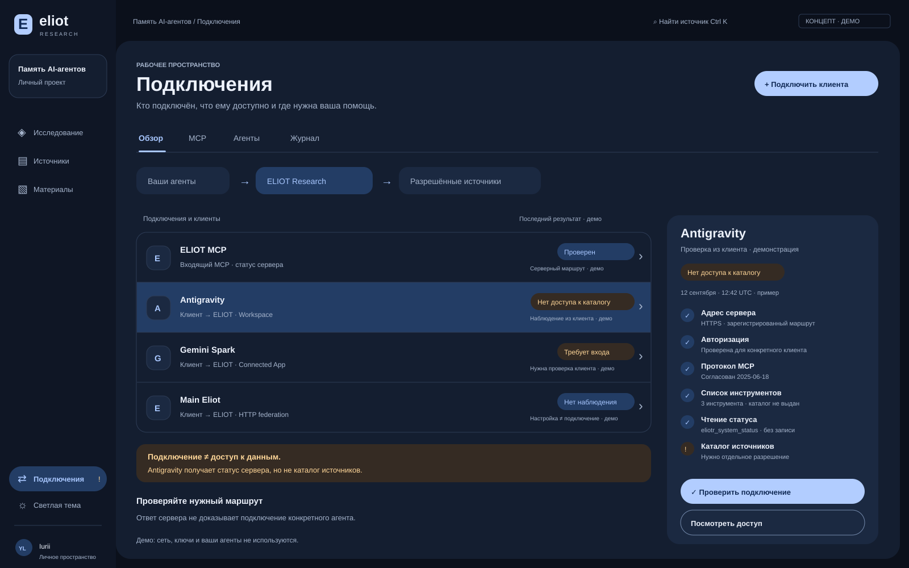
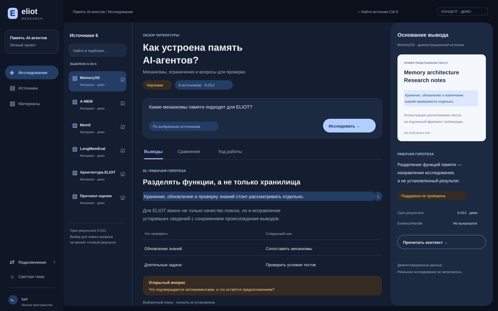

# Blue workspace v2 — дизайн-предложение

**Статус:** предложение владельцу, не новая архитектура и не готовая интеграция. Основание: `main` / `39c336f68f84879ccc85191d5686d82858afc63a`, проверено 12.09.2026. Заменяет прежнюю зелёную визуальную концепцию, но не нормативные контракты.

[Интерактивный прототип](blue-workspace.html) · [Исследование](research.svg) · [Подключения](connections.svg)

HTML — автономный демонстрационный интерфейс. Откройте сохранённый файл в браузере. Он не обращается в сеть, не принимает ключи и не подключает реальные аккаунты. SVG — самостоятельные векторные макеты той же концепции; их геометрия может немного отличаться от адаптивного HTML. Все наблюдения подключения и тексты исследования демонстрационные.

## 1. Что меняется

Не просто заменить зелёный на синий. Разделить рабочие задачи, чтобы человек сразу понимал: где исследовать, где выбирать материалы, где проверить подключение и какое действие исправляет проблему.

- **Исследование:** слева источники, в центре вопрос и документ, справа основание выбранного утверждения. Основной путь: выбрать → спросить → прочитать → проверить.
- **Источники:** добавление, готовность, версии и подборки. Открытие документа не включает его автоматически в исследование. Снятие checkbox не отнимает имеющийся доступ к чтению.
- **Материалы:** сохранённые обзоры, Wiki и отчёты. Активировать по наличию соответствующих серверных возможностей; не выставлять пустую «студию генераторов».
- **Подключения:** отдельная постоянная точка навигации с понятным индикатором проблемы. Вкладки «Обзор / MCP / Агенты / Журнал». Не прятать диагностику в настройках или в панели цитаты.

«Обзор корпуса / Lens» остаётся продуктовой возможностью внутри работы с источниками, а не исчезает из архитектуры. Поиск, структура и тематические группы доступны из раздела «Источники». На первом уровне не нужны одновременно Library, Corpus, Lens, Atlas, Sources и Documents.

Сохранить максимум контекста, но показывать только нужные инструменты: экран подключений использует список и инспектор соединения, а не бессмысленные панели корпуса и доказательств. При возврате к исследованию восстановить расположение панелей, а приватные данные повторно разрешить по действующим правилам.

## 2. Гамма и визуальные роли

**Midnight + Ice:** нейтральный ночной фон, поверхности с лёгким синим оттенком, холодный светлый акцент. **Porcelain + Cobalt:** светлая бумага, серо-голубой фон, насыщенный кобальт для действий. Зелёный, оливковый, хаки и бирюзовые фоны не использовать, в том числе для success.

| Роль | Тёмная | Светлая |
|---|---|---|
| Canvas | `#0B101B` | `#EEF2F8` |
| Navigation | `#0F1625` | `#E7EDF6` |
| Surface | `#141E30` | `#FFFFFF` |
| Raised | `#1B2941` | `#F2F5FB` |
| Text | `#EDF2FC` | `#17243C` |
| Secondary text | `#A5B4CC` | `#53657E` |
| Action | `#B2CDFF` | `#2459B8` |
| On action | `#102954` | `#FFFFFF` |
| Selection | `#233D65` | `#DCE8FF` |
| Accent text | `#A8C7FF` | `#2456A4` |
| Control boundary | `#758BAD` | `#7588A5` |
| Warning text / fill | `#FFD698` / `#352B23` | `#825200` / `#FFF1D7` |
| Error text / fill | `#FFB7C2` / `#382332` | `#A52845` / `#FFEDF1` |

Синий сам по себе означает выделение, не истинность. Положительный результат — **значок + предмет проверки + время**, например «✓ Статус прочитан · 12:42». Не обозначать одним словом «Connected» транспорт, права, свежесть, исполнение агента и доступ к источникам.

Material — принципы компоновки, тональных поверхностей, иерархии и осмысленного движения, а не обязательная зависимость MUI. Без декоративного glassmorphism, градиента на каждом блоке, бесконечного пульсирования и огромных счётчиков.

Типографика: кириллица и латиница одной гарнитурой; системный Segoe UI/Arial допустим. Заголовок 30–36 px, текст исследования 15–17 px / 1.6–1.75, контролы 13–14 px, вторичная метаинформация 11–12 px. Моноширинный только для кода и идентификаторов. Длинные абзацы ограничить примерно 65–80 знаками. Ультраширокий монитор не должен растягивать одну строку на всю ширину.

Основной шаг отступов 8 px; крупные панели 20–26 px radius, вложенные блоки 12–18 px, основные действия pill высотой не менее 44 px. Разделять группы пространством, а не рамкой вокруг каждого предложения. Анимации 120–180 ms только как обратная связь; учитывать reduced motion.

## 3. Исследовательский экран

Верхний уровень: проект → название исследования → статус документа. Вопрос и область запроса рядом с единственным главным действием «Исследовать». Вкладки результата: **«Выводы / Сравнение / Ход работы»**. «Матрица источников» понятна специалисту, «Сравнение» легче распознаётся без обучения.

Нажатие `[1]` выделяет конкретное утверждение и открывает его основание, не просто карточку публикации. Справа: точный фрагмент, соседний контекст, закреплённая ревизия, доступная координата, состояние смысловой поддержки. Технические hash/trace/handle — в раскрываемых деталях. Нет корректной карты страниц — нет выдуманного номера страницы или псевдо-PDF. SVG и HTML используют явно обозначенную иллюстрацию, а не поддельный первоисточник.

Не смешивать состояния: источник загружен; источник допущен; поиск готов; фрагмент разрешён и сверен; утверждение поддержано; исследование завершено; артефакт опубликован. Иконка целостности текста не подтверждает интерпретацию.

Сравнение включает метод, условия, данные, метрику, результат, ограничение и ссылку. Пустая ячейка — «Не извлечено», не отрицательный результат. Рабочая гипотеза и противоречие имеют локальную подпись. Не добавлять неподтверждённую «уверенность 97%».

Выбор для следующего запроса и срез готового результата различаются. Изменение checkbox не переписывает S-012. Исторический артефакт доступен только пока его чтение разрешено; отзыв прав и purge очищают приватные фрагменты. Обычный поиск сообщает «Выборочный поиск · полнота не установлена». Полное покрытие требует серверного CoverageReceipt, не размера списка или завершения Workflow.

## 4. Подключения: правильная модель для человека

### Три независимых объекта

**MCP-сервер ELIOT:** адрес и выбранный профиль, поддержанные версии, инструменты, состояние собственного серверного пути. Проверка из backend не доказывает подключение ноутбука пользователя.

**Клиент/агент → ELIOT:** конкретное приложение, проверенная сервером идентичность, роль, разрешённый проект, последний подтверждённый запрос, результат проверки со стороны клиента. Не считать `clientInfo.name` идентичностью. Настроенный профиль, запущенный локальный процесс и активная исследовательская задача — разные факты.

**ELIOT → внешний сервис:** отдельное направление, показываемое только при существующем адаптере. В выбранном Workspace-профиле Drive подключён через внешний клиент; это не прямой универсальный MCP-клиент в Worker. Нельзя рисовать GitHub/Drive/arXiv как действующие прямые MCP-подключения ELIOT без реализации.

Исследовательский сервис не становится Swarm Controller. Кнопки «проверить агента» не запускают CLI, не создают агентскую задачу и не дают Research права управлять Main Eliot. Федерация сохраняет направление: запрос клиента → ограниченный результат Research.

### Карточка подключения

Первый уровень: название, направление, состояние понятными словами, последняя проверка и её источник. Один клик открывает инспектор. Второй уровень: адрес без секретов, профиль, субъект в безопасном виде, согласованная версия, разрешённые инструменты, доступ к проекту, проверенные операции, время истечения наблюдения. Третий уровень: безопасные коды и trace/receipt для расследования.

Примеры состояний: «Не настроен», «Нет подтверждённого обращения», «Проверяем», «Требует входа», «Статус доступен», «Нет доступа к каталогу», «Версия несовместима», «Ответ не получен», «Проверка устарела», «Проверка не поддерживается». Это подписи view-model, не новый wire enum. Отсутствие heartbeat или SSE не означает offline. Честный неизвестный результат лучше фиктивной зелёной или синей точки.

Показывать время и направление наблюдения: «Сервер проверен из backend», «Запрос подтверждён от Antigravity», «Данные сообщены клиентом, не проверены». Устаревшую квитанцию не стирать: оставить как историческую, не выдавать за текущее соединение.

### Проверка по шагам

1. Зарегистрированный адрес/transport доступен.
2. Авторизация прошла для требуемого профиля и субъекта.
3. `initialize` согласовал общую версию; `notifications/initialized` завершил согласование.
4. `tools/list` вернул разрешённые инструменты с валидными схемами. Пагинация ограничена; неполный каталог не выдать за полный.
5. Только allowlisted безвредный диагностический вызов, например существующий `eliotr_system_status`, вернул корректный результат без `isError=true`.
6. Отдельно — наличие прав для нужного действия/проекта. Отсутствие `eliotr_catalog` по политике не означает, что MCP сломан.

При ошибке зависимые шаги «Не выполнялись». HTTP 200 с JSON-RPC error или `isError=true` — ошибка, а не успешный тест. Timeout — неопределённое наблюдение, не доказательство выключенного сервера. Диагностика не запускает исследование, модель, запись в Google, receipt mutation, автоматический retry неизвестного платного действия или расширение scope. Аннотация `readOnlyHint` сама по себе не является разрешением или гарантией безопасности.

Тестировать только заранее зарегистрированные маршруты. Никакого поля «любой URL для проверки», обхода localhost/private addresses, автоматического следования недоверенным redirect или передачи секретов между origin. Тайм-аут, общий предел работы, ограничение размера ответа и отмена обязательны. Пользовательский «Проверить» создаёт ограниченную операцию; остановка ожидания не подменяет серверную отмену.

### Подключение клиента

Мастер: **выбрать профиль → настроить адрес и вход в самом клиенте → выполнить запрос из клиента → увидеть серверное подтверждение → отдельно проверить разрешения**. Не включать фиктивный «Готово» сразу после копирования URL.

Antigravity и Gemini Spark — профили текущей документации, не live-qualified обещания. Codex, OpenCode, Claude и Main Eliot в концепте иллюстрируют будущие/отдельные клиентские профили; адаптер, авторизация и совместимость должны быть установлены отдельно. Само наличие карточки не объявляет поддержку.

Для входящего клиента backend не может честно «пинговать приложение» без согласованного канала. Нужен запрос, реально прошедший из клиента, и серверная квитанция, связанная с авторизованным actor, endpoint, проверкой, поколением credential/deployment и сроком. Непроверенный клиентский self-report остаётся self-report. При отсутствии такого серверного контракта показывать инструкцию и «Проверка пока недоступна», а не имитировать heartbeat.

Действия исправления зависят от причины: вход — «Открыть инструкцию входа»; scope — «Посмотреть разрешения»; версия — «Показать поддерживаемые версии»; timeout — «Проверить ещё раз». Не рекомендовать переподключение там, где авторизация уже прошла, а отсутствует grant.

## 5. Что реально существует в рассмотренном main

См. [MCP runtime](../implementation/gemini-spark-mcp.md), [ER-25](../agent-work/ER-25-owner-pwa.md), [gap register](../implementation/gap-register.md), [architecture](../architecture/ELIOT_RESEARCH.md).

- PWA уже имеет health, Library/Lens, retrieval, research-run и evidence-rail. Перекомпоновать существующие модули и strict decoders, не строить второй backend.
- Активный профиль `gemini-mcp` не требует нового Google Cloud проекта или custom OAuth клиента. Legacy `drive-exchange` — другой, невыбранный профиль.
- Рассмотренный MCP код поддерживает `2025-06-18` и `2025-03-26`. Это версии **репозитория**, не утверждение об актуальности всего стандарта. Автообновление протокола в дизайн-задачу не входит.
- Текущий MCP stateless, без session ID, resources/prompts и обязательного SSE. `GET /mcp = 405` здесь не ошибка работоспособности. Прямой browser Origin отвергается.
- Реально выдаваемый каталог содержит три инструмента: `eliotr_system_status`, `eliotr_create_google_sync_plan`, `eliotr_validate_google_sync_receipt`. `eliotr_catalog` в контракте существует, но без service-scope адаптера не выдаётся; прямой вызов получает `MCP_CATALOG_SCOPE_REQUIRED`.
- Подтверждённый Access login не равен namespace grant. Owner credential нельзя преобразовывать в service principal или отправлять на другой audience для удобства UI.
- Общий реестр подключений, новые owner diagnostics endpoints, клиентские квитанции и универсальный контроль агентов этим PR **не реализуются**. Их наличие перед интеграцией нужно проверить по актуальному main.

Не выдавать браузеру Access service-token или upstream credentials. Реальная кнопка работает через owner HTTPS API и утверждённый серверный адаптер. Обход запрета browser Origin недопустим. Отдельная review требуется для versioned diagnostic DTO, read-only server operation, долговечной квитанции и правил доступа, если таких контрактов ещё нет. Не придумывать маршруты как уже доступные.

## 6. Реализация по небольшим этапам

**D1 — оболочка и тема, ER-25.** Токены, размеченная навигация, адаптивный layout, темы, фокус и отсутствие переполнения. Перенести импорт и настройки из длинной ленты форм в контекстные панели. Существующие процедуры восстановления и strict envelopes не ослаблять.

**D2 — исследовательское чтение, ER-25 с существующими API.** Источники → вопрос → настоящий DRAFT → citation → exact fragment. Сначала подключить имеющееся, затем добавить сравнение/Wiki по готовности server capability. Не маркировать текст «проверенным» за красивое оформление.

**D3 — read-only Connections, ER-25 + ER-17/21/24/36; ER-22 для federation.** Сначала отображать существующий health/profile и честное отсутствие данных. Затем согласовать недостающие diagnostics/observations контракты. Сохранить разделение серверного пути, клиентского наблюдения и scope. Статус UI берётся из серверной квитанции, а не timers или localStorage.

**D4 — клиентский onboarding и восстановление.** Только после D3 добавить реально проверяемый мастер. Secret-free конфигурация, server-bound readback, ошибки и устаревание, read-only журнал. Нет обхода профиля и автоматического повышения прав.

Производственный стек остаётся Astro + TypeScript + CSS и существующий owner API. Не вводить React/Next/MUI, графовую библиотеку, отдельный WebSocket-сервис, MCP Inspector в production или orchestration framework ради этой задачи. UI не владеет policy/canonicalization и не дублирует Rust authority. CSS/HTML прототип — визуальный ориентир, не замена модульной архитектуры приложения.

## 7. Адаптивность и доступность

На широком экране три исследовательские панели плюс навигация. На среднем сначала убрать инспектор в управляемую панель, затем источники. На телефоне одна рабочая область и нижняя подписанная навигация. Таблицы прокручиваются локально. Подключения на телефоне: список → детали выбранного подключения, с явным возвратом; не заставлять искать инспектор внизу многометровой страницы. Текущий HTML использует упрощённый stacked вариант как визуальную демонстрацию, не финальную мобильную навигацию.

В реализации обеспечить WCAG 2.2 AA: контраст обычного текста ≥4.5:1, значимых границ/иконок ≥3:1, видимый фокус, 200% zoom, клавиатуру, доступные имена, aria-live только для новых существенных событий. Главные цели касания ≥44 px; inline citation ≥24 px с достаточными интервалами. Модальная панель удерживает и возвращает фокус; немодальная не притворяется modal. Escape закрывает слой, Browser Back возвращает предыдущий экран. Статус никогда не передаётся одним цветом.

## 8. Приёмка

- Человек без документации находит: добавить источник; поставить вопрос; открыть основание вывода; проверить конкретное подключение. Цель usability-test: выполнить эти четыре сценария без подсказки. Это цель, не уже измеренный результат.
- Preview работает без сервера. Весь демонстрационный результат явно обозначен. Контактов с MCP/model/Google/агентами нет; CSP запрещает сеть. Сценарии проверки в HTML показывают UX, не conformance.
- В production проверка не может показывать успех при 401/403, protocol mismatch, `isError`, неполном каталоге, timeout, неизвестной схеме, stale credential/deployment или утраченном доступе.
- Server-only probe никогда не делает конкретный клиент «подключённым». Клиентское имя и настройка не подменяют actor-bound receipt. Неизвестная агентская активность не называется offline.
- Список инструментов и права на проект видны отдельно. Проверка не меняет разрешения и не выдаёт `eliotr_catalog` по факту Access login.
- Отказ Drive/модели не блокирует разрешённые библиотечные операции. Logout/revoke/offline по существующим правилам очищают приватное состояние; поздний ответ не возвращает его.
- Проверить 360/390/768/1024/1280/1440/1600 px, светлую/тёмную тему, keyboard, browser back, reduced motion, zoom и длинные RU/EN названия. Реальный accessibility audit остаётся обязательным.
- Начальный JS не превышает существующий ER-25 предел 600 KiB gzip. Не включать графы/редакторы/тяжёлые SDK в первый экран.
- Перед implementation merge: актуальные repository gates, `pnpm check:affected`, существующие browser/storage негативные сценарии и разрешённые live receipts. Дизайн-PR не закрывает production/readiness gates.

## Основания дизайна

Проверено 12.09.2026. Ссылки описывают используемые принципы, не подтверждают live-готовность ELIOT.

- [Material: layout](https://m3.material.io/foundations/layout/layout-overview) и [navigation rail](https://m3.material.io/components/navigation-rail/overview): иерархия, адаптивная навигация, понятные направления.
- [MCP lifecycle 2025-06-18](https://modelcontextprotocol.io/specification/2025-06-18/basic/lifecycle): согласование версии и capabilities.
- [MCP tools 2025-06-18](https://modelcontextprotocol.io/specification/2025-06-18/server/tools): discovery, пагинация, errors и ограничения доверия к аннотациям.
- [WCAG 2.2 target size](https://www.w3.org/WAI/WCAG22/Understanding/target-size-minimum.html): размер и интервалы интерактивных целей.
