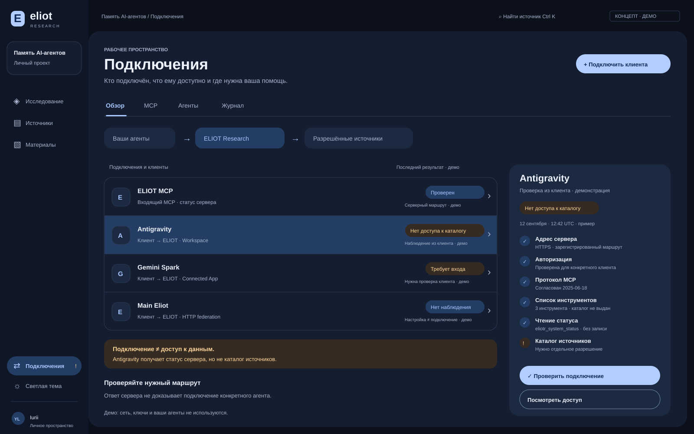
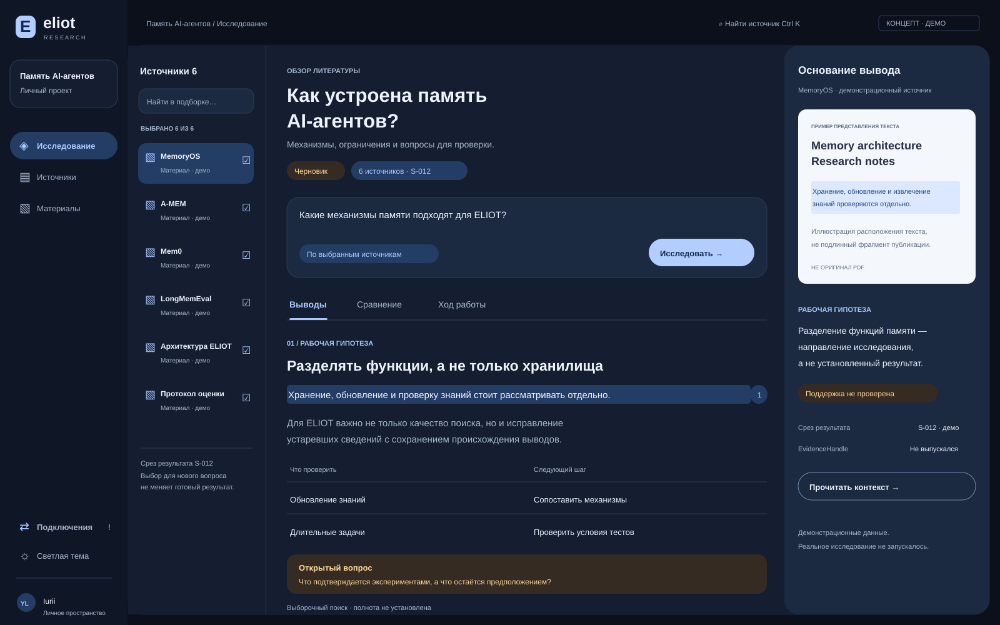

# Design documentation

## Current owner-web authority

The replacement owner workspace is governed by:

- [Eliot owner web UI](OWNER_WEB_UI.md) — normative information architecture, Material 3 roles,
  interaction, accessibility, content and visual-acceptance rules;
- [ADR-0016](../adr/0016-react-cloudflare-owner-ui.md) — React/Vite/Cloudflare architecture;
- [ADR-0017](../adr/0017-owner-web-browser-runtime-and-tooling.md) — browser caching, CSP,
  service-worker and bfcache lifecycle;
- [frontend migration plan](../implementation/frontend-platform-migration.md);
- [live NotebookLM/Material reference protocol](../agent-work/frontend-notebooklm-material-reference.md);
- [Material UI agent playbook](../agent-work/frontend-material-agent-playbook.md);
- [autonomous manager runbook](../agent-work/frontend-autonomous-manager-runbook.md).

The Blue Workspace v2 material below is retained as **historical design research** from 2026-09-12. It is
not production-stack or implementation authority. In particular, its section 6 instruction to keep Astro
and prohibit React is superseded by ADR-0016. Its prototypes, colors and geometry may inform comparison, but
must not be copied as production tokens/components or used to preserve the legacy DOM/CSS architecture.

---

# Blue workspace v2 — historical design proposal

**Historical status:** owner proposal based on `main` / `39c336f68f84879ccc85191d5686d82858afc63a`,
reviewed 2026-09-12. It replaced the older green visual concept but never became normative architecture.

[Интерактивный прототип](blue-workspace.html) · [Исследование](research.svg) · [Подключения](connections.svg)

HTML — автономный демонстрационный интерфейс. Откройте сохранённый файл в браузере. Он не обращается в сеть,
не принимает ключи и не подключает реальные аккаунты. SVG — самостоятельные векторные макеты той же
концепции; их геометрия может немного отличаться от адаптивного HTML. Все наблюдения подключения и тексты
исследования демонстрационные.

## 1. Что меняется

Не просто заменить зелёный на синий. Разделить рабочие задачи, чтобы человек сразу понимал: где исследовать,
где выбирать материалы, где проверить подключение и какое действие исправляет проблему.

- **Исследование:** слева источники, в центре вопрос и документ, справа основание выбранного утверждения.
  Основной путь: выбрать → спросить → прочитать → проверить.
- **Источники:** добавление, готовность, версии и подборки. Открытие документа не включает его автоматически
  в исследование. Снятие checkbox не отнимает имеющийся доступ к чтению.
- **Материалы:** сохранённые обзоры, Wiki и отчёты. Активировать по наличию соответствующих серверных
  возможностей; не выставлять пустую «студию генераторов».
- **Подключения:** отдельная постоянная точка навигации с понятным индикатором проблемы. Вкладки
  «Обзор / MCP / Агенты / Журнал». Не прятать диагностику в настройках или в панели цитаты.

«Обзор корпуса / Lens» остаётся продуктовой возможностью внутри работы с источниками, а не исчезает из
архитектуры. Поиск, структура и тематические группы доступны из раздела «Источники». На первом уровне не
нужны одновременно Library, Corpus, Lens, Atlas, Sources и Documents.

Сохранить максимум контекста, но показывать только нужные инструменты: экран подключений использует список и
инспектор соединения, а не бессмысленные панели корпуса и доказательств. При возврате к исследованию
восстановить расположение панелей, а приватные данные повторно разрешить по действующим правилам.

## 2. Гамма и визуальные роли

**Midnight + Ice:** нейтральный ночной фон, поверхности с лёгким синим оттенком, холодный светлый акцент.
**Porcelain + Cobalt:** светлая бумага, серо-голубой фон, насыщенный кобальт для действий. Зелёный, оливковый,
хаки и бирюзовые фоны не использовать, в том числе для success.

| Роль | Тёмная | Светлая |
|---|---|---|
| Canvas | `#0B101B` | `#EEF2F8` |
| Navigation | `#0F1625` | `#E7EDF6` |
| Surface | `#141E30` | `#FFFFFF` |
| Raised | `#1B2941` | `#F2F5FB` |
| Text | `#EDF2FC` | `#17243C` |
| Secondary text | `#A5B4CC` | `#53657E` |
| Action | `#B2CDFF` | `#2459B8` |
| On action | `#102954` | `#FFFFFF` |
| Selection | `#233D65` | `#DCE8FF` |
| Accent text | `#A8C7FF` | `#2456A4` |
| Control boundary | `#758BAD` | `#7588A5` |
| Warning text / fill | `#FFD698` / `#352B23` | `#825200` / `#FFF1D7` |
| Error text / fill | `#FFB7C2` / `#382332` | `#A52845` / `#FFEDF1` |

Синий сам по себе означает выделение, не истинность. Положительный результат — **значок + предмет проверки +
время**, например «✓ Статус прочитан · 12:42». Не обозначать одним словом «Connected» транспорт, права,
свежесть, исполнение агента и доступ к источникам.

Material — принципы компоновки, тональных поверхностей, иерархии и осмысленного движения, а не обязательная
зависимость MUI. Без декоративного glassmorphism, градиента на каждом блоке, бесконечного пульсирования и
огромных счётчиков.

Типографика: кириллица и латиница одной гарнитурой; системный Segoe UI/Arial допустим. Заголовок 30–36 px,
текст исследования 15–17 px / 1.6–1.75, контролы 13–14 px, вторичная метаинформация 11–12 px.
Моноширинный только для кода и идентификаторов. Длинные абзацы ограничить примерно 65–80 знаками.
Ультраширокий монитор не должен растягивать одну строку на всю ширину.

Основной шаг отступов 8 px; крупные панели 20–26 px radius, вложенные блоки 12–18 px, основные действия pill
высотой не менее 44 px. Разделять группы пространством, а не рамкой вокруг каждого предложения. Анимации
120–180 ms только как обратная связь; учитывать reduced motion.

## 3. Исследовательский экран

Верхний уровень: проект → название исследования → статус документа. Вопрос и область запроса рядом с
единственным главным действием «Исследовать». Вкладки результата: **«Выводы / Сравнение / Ход работы»**.
«Матрица источников» понятна специалисту, «Сравнение» легче распознаётся без обучения.

Нажатие `[1]` выделяет конкретное утверждение и открывает его основание, не просто карточку публикации.
Справа: точный фрагмент, соседний контекст, закреплённая ревизия, доступная координата, состояние смысловой
поддержки. Технические hash/trace/handle — в раскрываемых деталях. Нет корректной карты страниц — нет
выдуманного номера страницы или псевдо-PDF. SVG и HTML используют явно обозначенную иллюстрацию, а не
поддельный первоисточник.

Не смешивать состояния: источник загружен; источник допущен; поиск готов; фрагмент разрешён и сверен;
утверждение поддержано; исследование завершено; артефакт опубликован. Иконка целостности текста не
подтверждает интерпретацию.

Сравнение включает метод, условия, данные, метрику, результат, ограничение и ссылку. Пустая ячейка —
«Не извлечено», не отрицательный результат. Рабочая гипотеза и противоречие имеют локальную подпись. Не
добавлять неподтверждённую «уверенность 97%».

Выбор для следующего запроса и срез готового результата различаются. Изменение checkbox не переписывает
S-012. Исторический артефакт доступен только пока его чтение разрешено; отзыв прав и purge очищают приватные
фрагменты. Обычный поиск сообщает «Выборочный поиск · полнота не установлена». Полное покрытие требует
серверного CoverageReceipt, не размера списка или завершения Workflow.

## 4. Подключения: правильная модель для человека

### Три независимых объекта

**MCP-сервер ELIOT:** адрес и выбранный профиль, поддержанные версии, инструменты, состояние собственного
серверного пути. Проверка из backend не доказывает подключение ноутбука пользователя.

**Клиент/агент → ELIOT:** конкретное приложение, проверенная сервером идентичность, роль, разрешённый проект,
последний подтверждённый запрос, результат проверки со стороны клиента. Не считать `clientInfo.name`
идентичностью. Настроенный профиль, запущенный локальный процесс и активная исследовательская задача — разные
факты.

**ELIOT → внешний сервис:** отдельное направление, показываемое только при существующем адаптере. В выбранном
Workspace-профиле Drive подключён через внешний клиент; это не прямой универсальный MCP-клиент в Worker.
Нельзя рисовать GitHub/Drive/arXiv как действующие прямые MCP-подключения ELIOT без реализации.

Исследовательский сервис не становится Swarm Controller. Кнопки «проверить агента» не запускают CLI, не
создают агентскую задачу и не дают Research права управлять Main Eliot. Федерация сохраняет направление:
запрос клиента → ограниченный результат Research.

### Карточка подключения

Первый уровень: название, направление, состояние понятными словами, последняя проверка и её источник. Один
клик открывает инспектор. Второй уровень: адрес без секретов, профиль, субъект в безопасном виде,
согласованная версия, разрешённые инструменты, доступ к проекту, проверенные операции, время истечения
наблюдения. Третий уровень: безопасные коды и trace/receipt для расследования.

Примеры состояний: «Не настроен», «Нет подтверждённого обращения», «Проверяем», «Требует входа», «Статус
доступен», «Нет доступа к каталогу», «Версия несовместима», «Ответ не получен», «Проверка устарела», «Проверка
не поддерживается». Это подписи view-model, не новый wire enum. Отсутствие heartbeat или SSE не означает
offline. Честный неизвестный результат лучше фиктивной зелёной или синей точки.

Показывать время и направление наблюдения: «Сервер проверен из backend», «Запрос подтверждён от Antigravity»,
«Данные сообщены клиентом, не проверены». Устаревшую квитанцию не стирать: оставить как историческую, не
выдавать за текущее соединение.

### Проверка по шагам

1. Зарегистрированный адрес/transport доступен.
2. Авторизация прошла для требуемого профиля и субъекта.
3. `initialize` согласовал общую версию; `notifications/initialized` завершил согласование.
4. `tools/list` вернул разрешённые инструменты с валидными схемами. Пагинация ограничена; неполный каталог не
   выдать за полный.
5. Только allowlisted безвредный диагностический вызов, например существующий `eliotr_system_status`, вернул
   корректный результат без `isError=true`.
6. Отдельно — наличие прав для нужного действия/проекта. Отсутствие `eliotr_catalog` по политике не означает,
   что MCP сломан.

При ошибке зависимые шаги «Не выполнялись». HTTP 200 с JSON-RPC error или `isError=true` — ошибка, а не
успешный тест. Timeout — неопределённое наблюдение, не доказательство выключенного сервера. Диагностика не
запускает исследование, модель, запись в Google, receipt mutation, автоматический retry неизвестного платного
действия или расширение scope. Аннотация `readOnlyHint` сама по себе не является разрешением или гарантией
безопасности.

Тестировать только заранее зарегистрированные маршруты. Никакого поля «любой URL для проверки», обхода
localhost/private addresses, автоматического следования недоверенным redirect или передачи секретов между
origin. Тайм-аут, общий предел работы, ограничение размера ответа и отмена обязательны. Пользовательский
«Проверить» создаёт ограниченную операцию; остановка ожидания не подменяет серверную отмену.

### Подключение клиента

Мастер: **выбрать профиль → настроить адрес и вход в самом клиенте → выполнить запрос из клиента → увидеть
серверное подтверждение → отдельно проверить разрешения**. Не включать фиктивный «Готово» сразу после
копирования URL.

Antigravity и Gemini Spark — профили текущей документации, не live-qualified обещания. Codex, OpenCode,
Claude и Main Eliot в концепте иллюстрируют будущие/отдельные клиентские профили; адаптер, авторизация и
совместимость должны быть установлены отдельно. Само наличие карточки не объявляет поддержку.

Для входящего клиента backend не может честно «пинговать приложение» без согласованного канала. Нужен запрос,
реально прошедший из клиента, и серверная квитанция, связанная с авторизованным actor, endpoint, проверкой,
поколением credential/deployment и сроком. Непроверенный клиентский self-report остаётся self-report. При
отсутствии такого серверного контракта показывать инструкцию и «Проверка пока недоступна», а не имитировать
heartbeat.

Действия исправления зависят от причины: вход — «Открыть инструкцию входа»; scope — «Посмотреть разрешения»;
версия — «Показать поддерживаемые версии»; timeout — «Проверить ещё раз». Не рекомендовать переподключение там,
где авторизация уже прошла, а отсутствует grant.

## 5. Что реально существовало в рассмотренном main

См. [MCP runtime](../implementation/gemini-spark-mcp.md), [ER-25](../agent-work/ER-25-owner-pwa.md),
[gap register](../implementation/gap-register.md), [architecture](../architecture/ELIOT_RESEARCH.md).

- PWA уже имела health, Library/Lens, retrieval, research-run и evidence-rail. Перекомпоновать существующие
  contracts/strict decoders, не строить второй backend.
- Активный профиль `gemini-mcp` не требовал нового Google Cloud проекта или custom OAuth клиента. Legacy
  `drive-exchange` — другой профиль.
- Рассмотренный MCP код поддерживал `2025-06-18` и `2025-03-26`. Это версии репозитория, не утверждение об
  актуальности всего стандарта.
- Рассмотренный MCP был stateless, без session ID, resources/prompts и обязательного SSE. `GET /mcp = 405`
  здесь не ошибка работоспособности. Прямой browser Origin отвергался.
- Выдаваемый каталог содержал `eliotr_system_status`, `eliotr_create_google_sync_plan`,
  `eliotr_validate_google_sync_receipt`. `eliotr_catalog` без service-scope адаптера не выдавался.
- Access login не равнялся namespace grant. Owner credential нельзя преобразовывать в service principal или
  отправлять на другой audience для удобства UI.
- Общий реестр подключений, новые diagnostics endpoints, клиентские квитанции и универсальный контроль
  агентов этим историческим предложением не реализовывались.

Не выдавать браузеру Access service-token или upstream credentials. Реальная кнопка работает через owner
HTTPS API и утверждённый серверный адаптер. Обход запрета browser Origin недопустим.

## 6. Historical implementation direction — superseded

Historical D1–D4 proposed shell/theme, research reading, read-only Connections and client onboarding by
patching ER-25. It then required Astro + TypeScript + CSS and prohibited React.

**This implementation direction is superseded by ADR-0016 and must not be executed.** The product outcomes,
truthful connection model and negative cases above remain useful; the Astro/imperative delivery mechanism
does not.

## 7. Historical adaptive/accessibility notes

The proposal expected three research panes at wide widths, progressively moved Context/Sources into managed
panels, and one working area with signed navigation on phones. Tables could scroll locally. It targeted WCAG
2.2 AA, visible focus, 200% zoom, accessible names, restrained live regions, 44 px primary touch targets,
focus containment/return and non-color status. These outcomes are retained and expanded by
[OWNER_WEB_UI.md](OWNER_WEB_UI.md); the stacked prototype is not production mobile architecture.

## 8. Historical acceptance goals

- A person can add a source, ask a question, open evidence and inspect one connection without instructions.
- Demo previews contain only labeled fake data and no live MCP/model/Google calls.
- Production cannot show success for auth/protocol/error/timeout/stale/unknown states.
- Server-only probes never prove a specific client connection.
- Drive/model failure does not block authorized Library operations.
- Logout/revoke/offline clears private state and late responses cannot restore it.
- Responsive, theme, keyboard, Back, reduced-motion, zoom and long RU/EN behavior require real audit.
- Initial JavaScript remains within the owner-client budget and heavy editors/graphs stay out of first load.

Current acceptance commands and evidence are defined by the React migration plan, not this historical file.

## Historical design references

Checked 2026-09-12. These links explain principles, not current stack or live readiness.

- [Material layout](https://m3.material.io/foundations/layout/layout-overview) and
  [navigation rail](https://m3.material.io/components/navigation-rail/overview)
- [MCP lifecycle 2025-06-18](https://modelcontextprotocol.io/specification/2025-06-18/basic/lifecycle)
- [MCP tools 2025-06-18](https://modelcontextprotocol.io/specification/2025-06-18/server/tools)
- [WCAG 2.2 target size](https://www.w3.org/WAI/WCAG22/Understanding/target-size-minimum.html)
